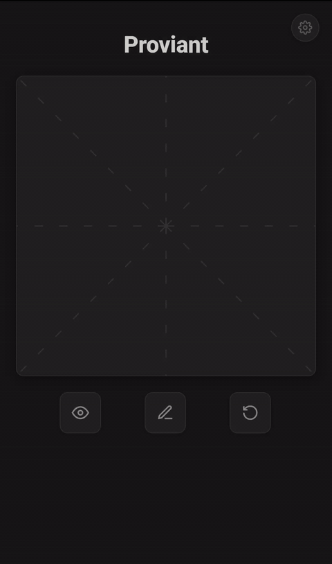
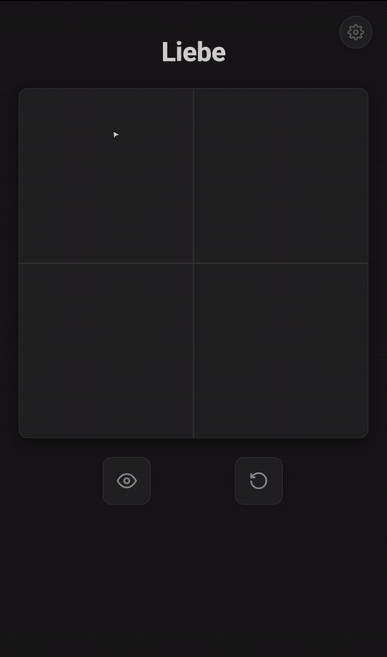
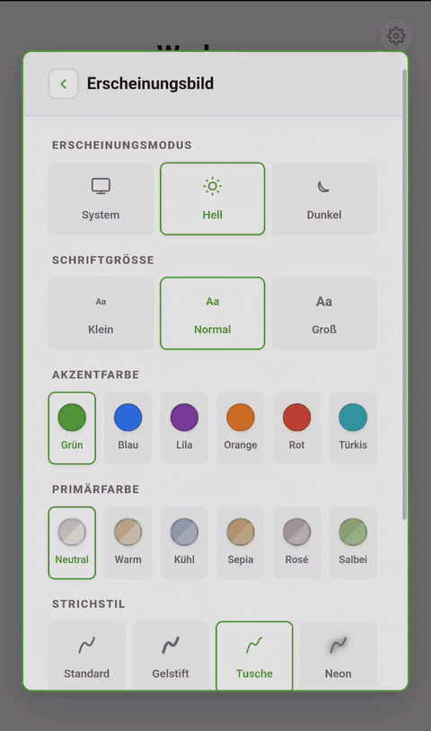
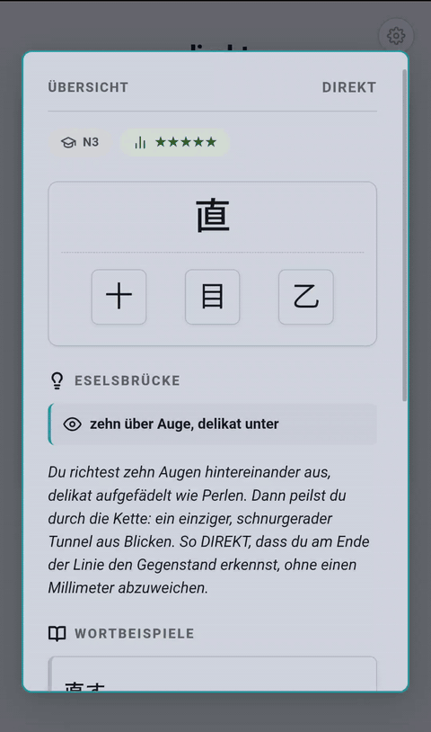
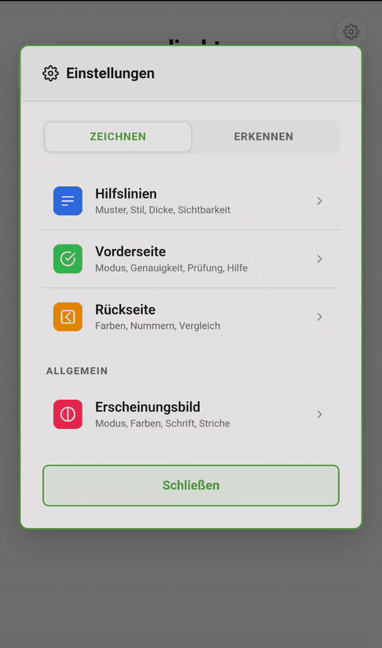
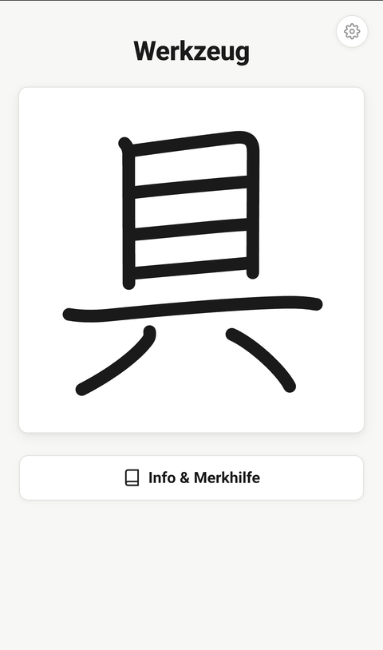

# Kanji Draw – Anki Note Template

Interaktives Anki-Template zum Erlernen der japanischen Kanji-Schriftzeichen — mit **echter Strich-Erkennung**, deutschen Eselsbrücken und voller Plattform-Kompatibilität.


---

## Vorschau

<table align="center">
  <tr>
    <td align="center"><br><sub>✍️ Geführter Modus</sub></td>
    <td align="center"><br><sub>🖊️ Freihand-Modus</sub></td>
    <td align="center"><br><sub>🎨 Erscheinungsbild</sub></td>
  </tr>
  <tr>
    <td align="center"><br><sub>📖 Info & Merkhilfe</sub></td>
    <td align="center"><br><sub>⚙️ Einstellungen</sub></td>
    <td align="center"><br><sub>🖼️ Galerie</sub></td>
  </tr>
</table>

---

## Übersicht

Das Template erzeugt **zwei Kartentypen** aus einem einzigen Notiztyp — beide mit vollständiger Zeichenfläche und Strich-Erkennung:

| Karte | Vorderseite | Rückseite |
|-------|------------|-----------|
| **Card 1 – Schreibkarte** | Zeichenfläche (Geführt & Freihand) + Strich-Erkennung | Ergebnis mit Farbcodierung + Vergleichsansicht + Info-Modal |
| **Card 2 – Erkennungskarte** | Zeichenfläche (Geführt & Freihand) + Strich-Erkennung | Farbige Strichreihenfolge + Ergebnis + Info-Modal |

---

## Features

### Strich-Erkennung (Card 1 & 2)

Zwei Zeichenmodi stehen zur Wahl:

- **Geführter Modus** — Strich für Strich: Das Template zeigt den nächsten Strich an, sobald der vorherige korrekt gezeichnet wurde. Automatischer Zeichenhinweis nach 3 Fehlversuchen (abschaltbar).
- **Freihand-Modus** — Freies Zeichnen: Das komplette Kanji wird in einem Zug gezeichnet. Der **Ungarische Algorithmus** ordnet anschließend jeden Nutzerstrich dem passenden Referenzstrich zu.

Der **Composite-Scoring-Algorithmus** basiert auf diskreter Fréchet-Distanz (iteratives DP, O(n²)):
- Jeder Nutzerstrich wird geglättet und auf **64 Abtastpunkte** resampled
- Bewertung aus vier Komponenten:
  - **Form** (Fréchet-Distanz) — 40 %
  - **Durchschnittlicher Punktabstand** — 25 %
  - **Startpunkt-Toleranz** — 17,5 %
  - **Endpunkt-Toleranz** — 17,5 %
- Hard-Gates: Längenverhältnis (40–250 %), 4-Sektor-Winkelprüfung, harter Deckel (1,4–1,6×)
- Drei **Genauigkeitsstufen**: Locker (×1,35) · Normal (×1,0) · Streng (×0,7)
- Echtzeit-Feedback mit farblicher Abstufung (Grün → Orange → Rot)

### Zeichenfläche & Visuelles (Card 1 & 2)

- SVG-basierte Zeichenfläche (109×109 Einheiten) mit Pointer-Events
- Drei **Stift-Stile** mit eigenem visuellen Charakter:
  - **Standard** — klarer, gleichmäßiger Strich
  - **Gelstift** — weicher Wet-Ink-Look mit leuchtendem Halo-Effekt
  - **Tusche** — variabler Pinselstrich mit dynamischer Breite
  - **Neon** — leuchtender Glow-Effekt (SVG-Filter)
- Konfigurierbares **Hilfslinien-Raster**: 3 Muster × 3 Stile × 3 Stärken × 3 Deckkräfte
- Strich-Animationen mit `stroke-dashoffset` (700 ms)
- **Abschluss-Animation**: Glow-Effekt + Bounce + Sparkle-Partikel (Web Animations API)
- Aktions-Buttons: Aufdecken · Überspringen · Zurücksetzen — mit haptischem Feedback

### Erkennungskarte (Card 2)

- Optionale **Strich-Darstellung** auf der Rückseite:
  - **Standard** — einheitliche Strichfarbe
  - **Farbig** — HSL-Regenbogenverlauf zeigt Strichreihenfolge (Hue 0°–300°)

### Rückseiten (Card 1 & 2)

- **Anti-Flicker-System**: Inline-`<style>` rendert Strichfarben VOR dem FrontSide-Injection
- **Fehler-Farbcodierung**: Grün (0 Fehler) → Orange → Dunkelorange → Rot (3+ Fehler)
- **Strichnummern** am Startpunkt jedes Strichs mit automatischer Positionierung
- **Vergleichsansicht (Side-by-Side)**: Nutzerstrich neben Referenzstrich — fehlende Striche werden rot markiert, überzählige Striche werden gestrichelt angezeigt
- **Info-Modal** mit:
  - JLPT-Level und Häufigkeitsrang
  - **Radikalbaum** — visuelle Kanji-Zerlegung mit antippbaren Tooltips und Primitiv-Markierungen
  - **Eselsbrücke** — deutsche Merkhilfe mit optionalem visuellem Hinweis
  - **Wortbeispiele** — antippbar mit Furigana-Anzeige (Ruby-Toggle)
  - ON- und KUN-Lesungen mit farbigen Labels
  - **Externe Links**: Jisho, Tatoeba, WaniKani, Koohii

### Einstellungen

Alle Optionen werden **pro Kartentyp** gespeichert (c1_/c2_-Prefixes) und sind über ein Zahnrad-Menü erreichbar. Das Einstellungsfenster hat zwei Tabs: **Zeichnen** (Card 1) und **Erkennen** (Card 2).

| Einstellung | Card 1 | Card 2 | Beschreibung |
|-------------|:------:|:------:|-------------|
| Zeichenmodus | ✓ | ✓ | Geführt (Strich für Strich) / Frei (alles auf einmal) |
| Strich-Genauigkeit | ✓ | ✓ | Locker / Normal / Streng |
| Echtzeit-Prüfung | ✓ | ✓ | Strich sofort validieren |
| Zeichen-Hilfe | ✓ | ✓ | Auto-Hinweis nach 3 Fehlern (nur Geführt) |
| Abschluss-Animation | ✓ | ✓ | Sparkle/Glow bei Erfolg |
| Farb-Bewertung | ✓ | ✓ | Farbcodierung auf der Rückseite an/aus |
| Strich-Nummern | ✓ | ✓ | Nummerierung auf der Rückseite an/aus |
| Vergleichsansicht | ✓ | — | Side-by-Side: Nutzerstrich neben Referenz |
| Strichansicht | ✓ | — | Rückseite: Handschrift beibehalten / SVG-Pfade einblenden |
| Strich-Darstellung | — | ✓ | Standard / Farbig (Regenbogen-Strichreihenfolge) |
| Hilfslinien-Raster | ✓ | ✓ | Muster, Stil, Stärke, Deckkraft |
| Stift-Stil | ✓ | ✓ | Standard / Gelstift / Tusche / Neon |
| Erscheinungsmodus | ✓ | ✓ | System / Hell / Dunkel |
| Akzentfarbe | ✓ | ✓ | 6 Farboptionen (Grün, Blau, Lila, Orange, Rot, Türkis) |
| Schriftgröße | ✓ | ✓ | Klein / Normal / Groß |

### Persistenz

Einstellungen folgen einer dreistufigen Fallback-Kette für maximale Kompatibilität:
`In-Memory (window._ks) → Cookie → localStorage`

Auf Android wird zusätzlich `CookieManager.flush()` über `visibilitychange`/`pagehide` ausgelöst.

**Anki Desktop:** Qt's WebEngine nutzt ein Off-The-Record-Profil — Cookies und localStorage werden bei jedem Neustart gelöscht. Das mitgelieferte **Add-on** löst dieses Problem: es speichert die Settings als JSON-Datei und stellt sie beim nächsten Start automatisch wieder her.

---

## Plattform-Kompatibilität

| Plattform | Status | Besonderheiten |
|-----------|:----------:|----------------|
| **Anki Desktop** (2.1+) | ✅<br>Unterstützt | Maus + Pointer-Events |
| **AnkiDroid** | ✅<br>Unterstützt | S-Pen-Unterstützung, haptisches Feedback, CookieManager-Flush |
| **AnkiMobile (iOS)** | ✅<br>Unterstützt | Apple Pencil, WKWebView-safe, `position:fixed` Scroll-Lock, Safe-Area-Insets |
| **AnkiWeb (Browser)** | ✅<br>Unterstützt | Dynamische Viewport-Anpassung, JS-basierte Größenberechnung, Scroll-Lock |
| **Dark Mode** | ✅<br>Automatisch | Erkennt `.nightMode` / `.night_mode` Klasse |
| **Stylus** | ✅<br>Unterstützt | Apple Pencil + S-Pen via `pointerup`-Fix (400 ms Debounce) |

### Plattform-Optimierungen

- **qFade = 0:** Ankis standardmäßige 100 ms Fade-Animation beim Kartenwechsel wird deaktiviert, um instantanes Rendering zu gewährleisten.
- **id=answer Marker:** Ein verstecktes `<div id="answer">` auf der Rückseite sorgt dafür, dass Anki automatisch zum Antwortbereich scrollt — besonders nützlich auf kleinen Bildschirmen und AnkiWeb.
- **userJs-Hooks für Gesten:**
  - **Card 1:** `userJs1` (Strich aufdecken) · `userJs2` (Zurücksetzen) · `userJs3` (Einstellungen)
  - **Card 2:** `userJs1` (Einstellungen)
  - Konfigurierbar über AnkiDroid (*Einstellungen → Gesten → JavaScript-Funktion*) und AnkiMobile (*Einstellungen → Gesten → Custom → Execute JS*).
- **CSS-Fallback-Selektoren:** iOS-spezifische Regeln (`position:fixed` Scroll-Lock, Modal-Padding, Safe-Area) nutzen neben `.is-ankimobile` zusätzlich Ankis eingebaute `.iphone`/`.ipad`-Klassen als Fallback, falls die JS-basierte Erkennung noch nicht ausgeführt wurde.
- **AnkiDroid localStorage:** Ab AnkiDroid 2.21+ muss localStorage in *Einstellungen → Erweitert → localStorage* explizit aktiviert werden, damit Persistenz über Sessions hinweg funktioniert.

---

## Notiztyp-Felder

| Feld | Pflicht | Beschreibung |
|------|:-------:|-------------|
| `Kanji` | ✓ | Das Schriftzeichen |
| `Bedeutung` | ✓ | Deutsche Übersetzung |
| `SVGPfade` | ✓ | SVG-`<path>`-Elemente für jeden Strich |
| `JLPT` | — | JLPT-Stufe (N5–N1) |
| `Häufigkeit` | — | Häufigkeitsrang |
| `Radikale` | — | Zerlegung in Radikale/Primitive |
| `Eselsbrücke` | — | Merkhilfe / Eselsbrücke |
| `Merkhilfe` | — | Visueller Hinweis zur Eselsbrücke |
| `Wortbeispiel` | — | Wortbeispiele mit Furigana |
| `Onyomi` | — | ON-Lesung (Katakana) |
| `Kunyomi` | — | KUN-Lesung (Hiragana) |

---

## Dateistruktur
```
Templates/
├── Card-1/
│   ├── FrontTemplate.html    ← Schreibkarte: Zeichenfläche + Erkennung + Settings
│   └── BackTemplate.html     ← Schreibkarte Rückseite: Ergebnis + Vergleichsansicht + Info-Modal
├── Card-2/
│   ├── FrontTemplate.html    ← Erkennungskarte: Zeichenfläche + Erkennung + Settings
│   └── BackTemplate.html     ← Erkennungskarte Rückseite: Strichreihenfolge + Ergebnis + Info-Modal
└── Styling.css               ← Gemeinsames Stylesheet (Dark/Light, Responsive, Animationen)

Addon/
├── __init__.py               ← Desktop-Add-on: Settings über Neustarts hinweg speichern
└── manifest.json             ← Add-on-Metadaten

Tests/
├── js/                       ← JavaScript-Tests (Node.js)
└── anki_addon_stress_helper/ ← Anki-Add-on für Live-Stresstests

Media/
└── demos/                    ← Demo-GIFs für die README-Vorschau
```

Jede Template-Datei wird in Anki direkt als Template-Inhalt eingefügt — **keine Plugins, keine externen Abhängigkeiten**.
Das Add-on ist **optional** und nur für Anki Desktop relevant (AnkiDroid/AnkiMobile speichern Cookies nativ).

---

## Installation

1. In Anki: **Werkzeuge → Notiztypen verwalten → Hinzufügen**
2. Notiztyp mit den oben genannten Feldern erstellen
3. Kartenvorlagen bearbeiten:
   - **Card 1 Vorderseite** → Inhalt von `Templates/Card-1/FrontTemplate.html`
   - **Card 1 Rückseite** → Inhalt von `Templates/Card-1/BackTemplate.html`
   - **Card 2 Vorderseite** → Inhalt von `Templates/Card-2/FrontTemplate.html`
   - **Card 2 Rückseite** → Inhalt von `Templates/Card-2/BackTemplate.html`
   - **Styling** → Inhalt von `Templates/Styling.css`

### Desktop-Add-on (optional)

Das Add-on sorgt dafür, dass Einstellungen auf **Anki Desktop** über Neustarts hinweg erhalten bleiben.

1. Den Ordner `Addon/` nach `~/.local/share/Anki2/addons21/kanji_draw_persistence/` kopieren (Linux) bzw. `%APPDATA%\Anki2\addons21\kanji_draw_persistence\` (Windows) bzw. `~/Library/Application Support/Anki2/addons21/kanji_draw_persistence/` (macOS)
2. Anki neu starten

Das Template funktioniert auch **ohne** das Add-on — Einstellungen werden dann lediglich bei jedem Neustart auf die Standardwerte zurückgesetzt.

---

## Technische Details

- **Kein Build-Schritt** — reines HTML/CSS/JS, direkt in Anki einsetzbar
- **Keine externen Requests** — alles offline-fähig, keine CDN-Abhängigkeiten
- **SVG-basiert** — pixelgenaue Strichpfade ermöglichen algorithmische Auswertung
- **Fréchet-Distanz** — mathematisch fundierte Kurvensimilarität (iteratives DP mit Float64Array)
- **Ungarischer Algorithmus** — optimale Strich-Zuordnung im Freihand-Modus (O(n³))
- **Web Animations API** — Celebration-Effekte ohne requestAnimationFrame-Loops
- **Mustache-safe** — keine `{{…}}`-Syntax in JS/CSS-Kommentaren (Ankis Template-Engine)

---

## Datenquellen & Attribution

- **Strichpfade (SVG):** [KanjiVG](https://github.com/KanjiVG/kanjivg) von Ulrich Apel — lizenziert unter [CC BY-SA 3.0](https://creativecommons.org/licenses/by-sa/3.0/).
- **Kanji-Reihenfolge, Bedeutungen & Primitivnamen:** Entnommen aus James W. Heisig / Robert Rauther, *„Die Kanji lernen und behalten"* (Klostermann-Verlag). Die Lernreihenfolge, die deutschen Schlüsselwörter sowie die Primitivbezeichnungen (z. B. „Zauberstab", „Eingepfercht", „Tierbeine") sind geistiges Eigentum der Autoren bzw. des Verlags.
- **SVG-Zerlegung nach Primitiven:** Die Zuordnung einzelner SVG-Strichpfade zu ihren Kanji-Komponenten wurde aus [Migaku Kanji God](https://github.com/migaku-official/Migaku-Kanji-Addon) von Migaku extrahiert — lizenziert unter [GPL v3](https://www.gnu.org/licenses/gpl-3.0.html).
- **Farbige Strichreihenfolge:** Inspiriert von [Kanji Colorizer](https://github.com/cayennes/kanji-colorize) von cayennes (Code: [AGPL v3](https://www.gnu.org/licenses/agpl-3.0.html), SVGs: [CC BY-SA 3.0](https://creativecommons.org/licenses/by-sa/3.0/)).
- **Eselsbrücken & Geschichten:** Erstellt von [PawMethod](https://github.com/PawMethod) unter Verwendung von KI-Sprachmodellen. Konzept, Prompt-Design, Kuration und Redaktion: PawMethod.

---

## Lizenz

Der **Quellcode** dieses Projekts (Templates, Add-on, Erkennungsalgorithmus) steht unter der [MIT-Lizenz](LICENSE).

Drittinhalte und eingebettete Daten behalten ihre jeweilige Lizenz:

| Bestandteil | Lizenz | Rechteinhaber |
|---|---|---|
| KanjiVG SVG-Strichpfade | [CC BY-SA 3.0](https://creativecommons.org/licenses/by-sa/3.0/) | Ulrich Apel |
| Migaku SVG-Zerlegung | [GPL v3](https://www.gnu.org/licenses/gpl-3.0.html) | Migaku |
| Kanji-Reihenfolge, Schlüsselwörter & Primitivnamen | Alle Rechte vorbehalten | James W. Heisig / Robert Rauther / Klostermann-Verlag |
| Merkhilfen & Eselsbrücken | [MIT](LICENSE) | PawMethod |

Siehe [LICENSE](LICENSE) für den vollständigen Lizenztext.